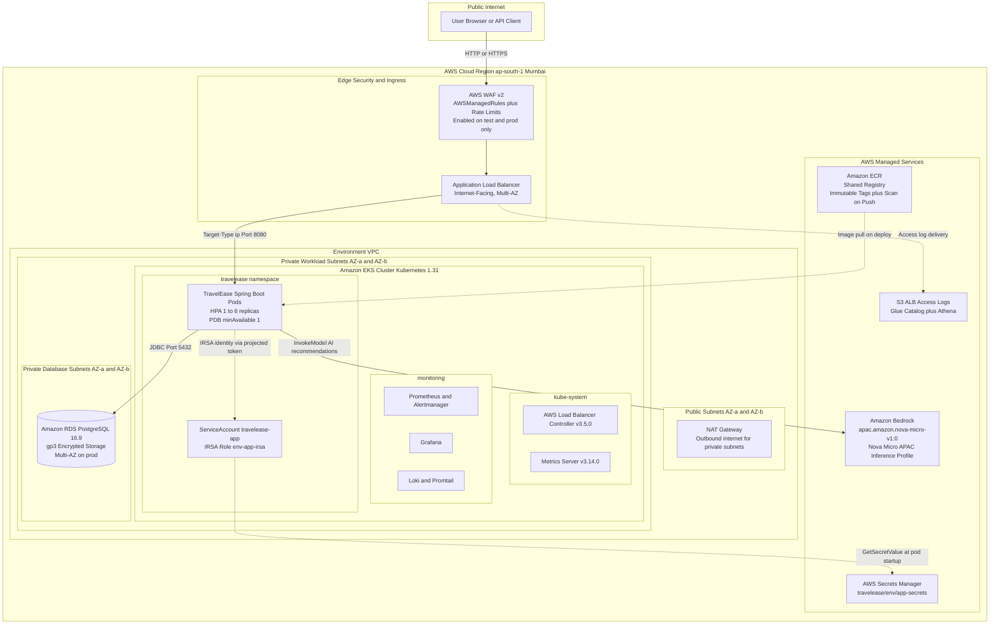
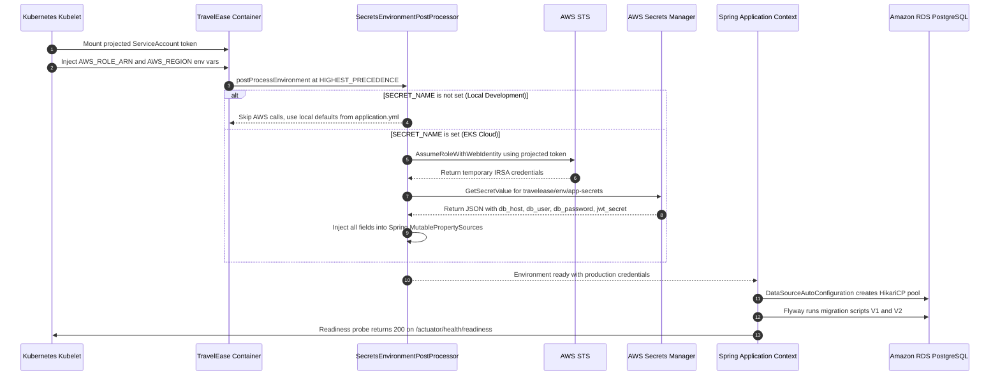
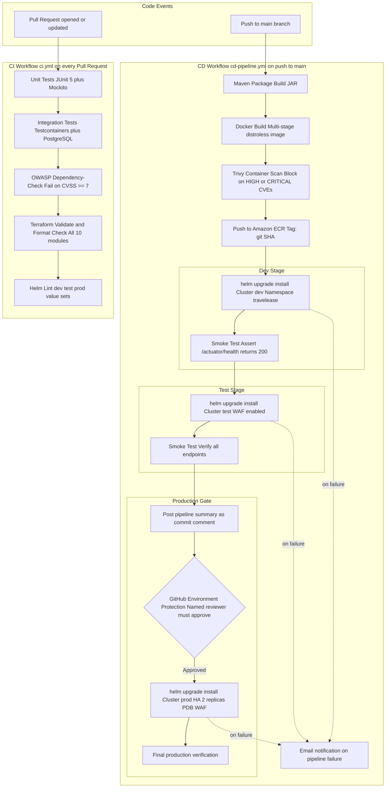
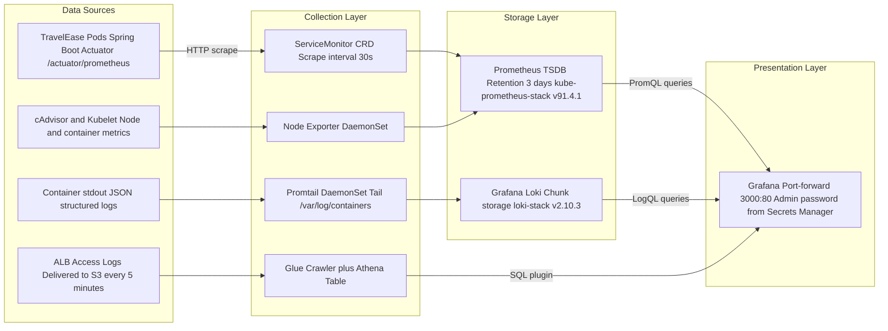
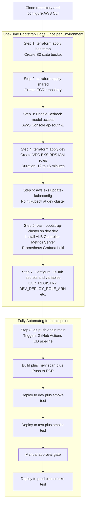
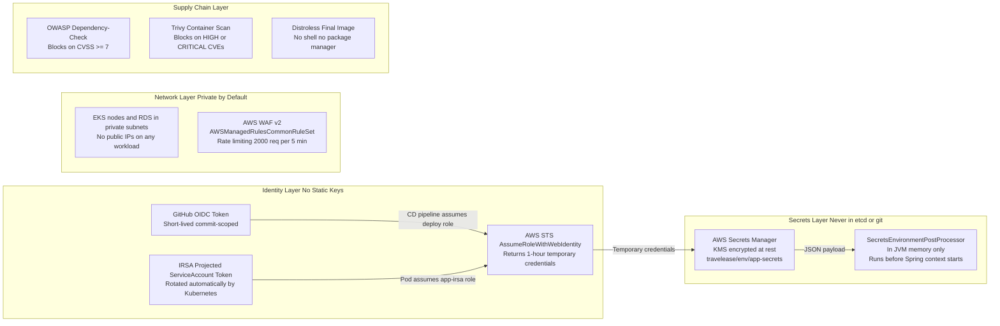

# TravelEase — AI-Powered Cloud-Native Travel Platform on AWS EKS

[](https://github.com/Lakshya6373/travelease-aws-eks-cicd/actions/workflows/ci.yml)
[](https://github.com/Lakshya6373/travelease-aws-eks-cicd/actions/workflows/cd-pipeline.yml)
[](https://kubernetes.io/)
[](https://www.terraform.io/)
[](https://spring.io/projects/spring-boot)
[](https://aws.amazon.com/)

---

## Table of Contents

- [Project Overview](#project-overview)
- [Technology Stack](#technology-stack)
- [System Architecture](#system-architecture)
  - [Infrastructure Topology](#1-infrastructure-topology)
  - [Secret Resolution and IRSA Flow](#2-secret-resolution-and-irsa-flow)
  - [CI/CD Pipeline and Promotion Flow](#3-cicd-pipeline-and-promotion-flow)
  - [Observability Stack](#4-observability-stack)
- [Repository Structure](#repository-structure)
- [Environment Configuration](#environment-configuration)
- [Prerequisites](#prerequisites)
- [Local Development](#local-development)
- [AWS Deployment Walkthrough](#aws-deployment-walkthrough)
- [GitHub Actions Setup](#github-actions-setup)
- [Verification and Runbook](#verification-and-runbook)
- [Security Architecture](#security-architecture)
- [Cost Design Decisions](#cost-design-decisions)
- [Troubleshooting](#troubleshooting)
- [Teardown](#teardown)

---

## Project Overview

TravelEase is a travel booking web application that allows users to search for destinations, make bookings, and get AI-powered travel recommendations. What makes this project special is not just the application itself — it is the complete production-grade infrastructure and deployment pipeline built around it.

Think of it this way: the application is the car, and everything else in this repository (Terraform, Kubernetes, Helm, GitHub Actions) is the factory, the roads, and the traffic management system that gets the car built, tested, and safely delivered to customers.

**The application** is a Java Spring Boot web app backed by a PostgreSQL database. It uses Amazon Bedrock (Amazon's AI service) to suggest travel destinations based on user preferences.

**The infrastructure** is deployed on AWS in three completely separate environments — `dev` for developers to test changes, `test` (staging) to verify before going live, and `prod` which is what real users access.

**The deployment pipeline** is fully automated. When a developer pushes code to the main branch, GitHub Actions automatically builds the application, scans it for security vulnerabilities, packages it into a Docker container, and deploys it to AWS — without anyone manually running commands.

The project demonstrates a complete, real-world DevOps implementation covering:

- **Infrastructure as Code** with Terraform — the entire AWS infrastructure (VPCs, EKS clusters, RDS databases, IAM roles) is defined in code files, not clicked through a web console
- **GitOps-style deployment** with Helm — Kubernetes deployments are managed through version-controlled Helm charts with per-environment configuration files
- **Zero-trust security** using IRSA (IAM Roles for Service Accounts) — the application never uses or stores AWS access keys; it proves its identity using a Kubernetes token
- **Automated multi-environment CI/CD** via GitHub Actions — code goes from a developer's laptop to production through an automated pipeline with quality gates
- **Unified observability** with Prometheus, Grafana, and Loki — every metric, log, and alert is visible in a single dashboard

At startup, the application fetches its database credentials and JWT signing key directly from AWS Secrets Manager using native AWS SDK calls and IRSA identity. No secrets are stored in code, environment files, Kubernetes ConfigMaps, or the git repository.

---

## Technology Stack

| Layer | Technology | Version | What It Does |
| :--- | :--- | :--- | :--- |
| Application | Spring Boot Java 17 Temurin | 3.3.4 | The web application itself — handles HTTP requests, business logic, and database queries |
| Database | Amazon RDS PostgreSQL | 16.9 | Stores all application data: users, bookings, destinations |
| Container Runtime | Docker Distroless Multi-Stage Build | Latest | Packages the application into a portable, minimal container image |
| Container Registry | Amazon ECR | — | Stores Docker images in AWS, like a private Docker Hub |
| Orchestration | Amazon EKS Kubernetes | 1.31 | Runs and manages containers at scale on AWS; handles restarts, scaling, health checks |
| Package Management | Helm | 3.17.1 | Kubernetes package manager — templates all Kubernetes manifests so one chart works for dev, test, and prod |
| Infrastructure as Code | Terraform | >= 1.11 | Defines all AWS resources (VPCs, EKS, RDS, IAM) as code files — no manual clicking in console |
| AI Inference | Amazon Bedrock Nova Micro APAC Profile | apac.amazon.nova-micro-v1:0 | AI model that generates travel recommendations for users |
| Secrets Management | AWS Secrets Manager | — | Stores database passwords and JWT keys securely; the app fetches them at startup |
| Identity | IRSA plus GitHub OIDC Federation | — | Lets the app and the CI/CD pipeline prove their identity to AWS without using static access keys |
| Monitoring | kube-prometheus-stack | 91.4.1 | Collects metrics from every pod and node; powers Grafana dashboards and Alertmanager |
| Log Aggregation | Grafana Loki plus Promtail | 2.10.3 | Collects all container logs and makes them searchable in Grafana |
| Ingress | AWS Load Balancer Controller | 3.5.0 | Creates and manages the AWS Application Load Balancer that receives public traffic |
| Edge Security | AWS WAF v2 | — | Sits in front of the load balancer; blocks common web attacks and rate-limits abusive IPs |
| CI/CD | GitHub Actions | — | Runs the automated build, test, scan, and deploy pipeline on every code push |

---

## Key Concepts Explained

If you are new to some of these technologies, here is a plain-English explanation of the key concepts used throughout this project:

**IRSA (IAM Roles for Service Accounts)** — Normally, to call AWS APIs from code, you need AWS access keys (a username and password for AWS). IRSA is a better approach: Kubernetes gives each pod a temporary token, and that token is exchanged with AWS for short-lived credentials. No keys are ever stored anywhere. If someone steals the pod's token, it expires in one hour and is useless outside of the specific role it is allowed to use.

**Helm** — Think of Helm as a template engine for Kubernetes. Instead of writing separate YAML files for dev, test, and prod (which would be almost identical with minor differences), Helm lets you write one template and pass in different values per environment. The `values-dev.yaml` file says "1 replica, no WAF", `values-prod.yaml` says "2 replicas, WAF on, more memory".

**Terraform** — Instead of logging into the AWS console and clicking "Create VPC", "Create EKS", "Create RDS" manually (which is error-prone and hard to repeat), Terraform lets you write what infrastructure you want in `.tf` files, and it creates/updates/destroys it for you. If you delete a resource, Terraform will re-create it exactly the same way.

**HPA (Horizontal Pod Autoscaler)** — Kubernetes watches CPU usage. If pods get busy (above 70% CPU), HPA automatically adds more pods. If traffic drops, it removes pods to save money. This is what makes the application automatically handle traffic spikes.

**PDB (Pod Disruption Budget)** — When Kubernetes needs to restart a node (for patching, scaling, etc.), PDB prevents it from removing too many pods at once. `minAvailable: 1` means Kubernetes guarantees at least one pod is always running — so the application never goes down during maintenance.

**Namespace** — A Kubernetes namespace is like a folder. All TravelEase resources (pods, services, configmaps) live in the `travelease` namespace. Monitoring lives in `monitoring`. This keeps resources organised and allows per-namespace resource limits (quota, limitrange).

**EKS (Elastic Kubernetes Service)** — Amazon's managed Kubernetes service. AWS manages the Kubernetes control plane (the brain of the cluster). You only manage the worker nodes (where your application pods actually run).

---

## How Everything Connects

Before reading the detailed diagrams, here is the big picture in plain English:

```
Developer pushes code to GitHub
        |
        v
GitHub Actions runs CI checks (tests, security scans, Helm lint)
        |
        v
If all checks pass: build Docker image, scan it, push to ECR (Amazon's Docker registry)
        |
        v
Helm deploys the image to the dev EKS cluster
        |
        v
Automated smoke tests verify the app is responding correctly
        |
        v
Same process repeats for test (staging) cluster
        |
        v
A human reviewer approves the production deployment
        |
        v
Helm deploys to the prod EKS cluster
```

Meanwhile, the running application:

```
User visits the website
        |
        v
Request hits AWS WAF (blocks attacks) then the Application Load Balancer
        |
        v
ALB routes the request to a Spring Boot pod inside EKS
        |
        v
The pod (using IRSA identity) reads database credentials from AWS Secrets Manager
        |
        v
The pod queries RDS PostgreSQL for data
        |
        v
For AI recommendations: the pod calls Amazon Bedrock Nova Micro
        |
        v
Response returns to the user
```

---

## System Architecture

### 1. Infrastructure Topology

The following diagram shows how traffic flows from the public internet through AWS edge services into private EKS workloads, and how the application accesses managed AWS services.

Note: All EKS nodes and the RDS database sit in **private subnets** — they have no public IP addresses. The only public entry point is the ALB, which itself sits behind WAF.



---

### 2. Secret Resolution and IRSA Flow

Rather than using third-party secret synchronisation operators, the application uses a Spring Boot `EnvironmentPostProcessor` that runs before any beans are created. This ensures database credentials are loaded from AWS Secrets Manager before `DataSourceAutoConfiguration` binds connection properties.



**Why this approach over External Secrets Operator:**

| Concern | External Secrets Operator | This Implementation |
| :--- | :--- | :--- |
| Cluster components required | ESO controller plus ClusterSecretStore CRDs | None — native AWS SDK only |
| Secret visibility | Synced into Kubernetes Secret object in etcd | Never written to etcd — in-memory only |
| Bootstrap complexity | Requires ESO to be installed and healthy first | No dependency; fails fast if IRSA is misconfigured |
| IAM scope | Separate IRSA role for ESO service account | Single IRSA role scoped to app service account |

---

### 3. CI/CD Pipeline and Promotion Flow

Every pull request triggers the CI workflow. Every push to `main` triggers the full CD pipeline. The pipeline promotes the same Docker image tagged by git SHA through dev, test, and then waits for a named reviewer to approve before deploying to production.



---

### 4. Observability Stack

Metrics, logs, and ALB access data are collected from three independent sources and unified in a single Grafana instance per cluster.



---

## Repository Structure

```
travelease-aws-eks-cicd/
|
|-- .github/workflows/
|   |-- ci.yml                      Pull request checks: unit tests, integration tests,
|   |                               OWASP scan, Terraform validate, Helm lint
|   `-- cd-pipeline.yml             Multi-environment CD: build, scan, push ECR,
|                                   deploy dev, test, manual gate, deploy prod
|
|-- app/                            Spring Boot application source
|   |-- src/main/java/ai/travelease/
|   |   |-- config/
|   |   |   |-- BedrockConfig.java              Bedrock runtime client ap-south-1 region
|   |   |   |-- SecretsConfig.java              AWS SecretsManagerClient bean
|   |   |   |-- SecretsEnvironmentPostProcessor.java
|   |   |   |                                   Loads secrets before Spring beans start.
|   |   |   |                                   Registered in META-INF/spring/*.imports
|   |   |   |-- SecurityConfig.java             SecurityFilterChain public actuator paths
|   |   |   `-- WebConfig.java                  MVC interceptors
|   |   |-- domain/                 JPA entities: User, Booking, Destination, Category
|   |   |-- dto/                    Request and response transfer objects
|   |   |-- repository/             Spring Data JPA repositories
|   |   |-- service/                Business logic and Bedrock Nova Micro integration
|   |   `-- web/                    Spring MVC controllers and Thymeleaf templates
|   |-- src/main/resources/
|   |   |-- application.yml         Central configuration with safe local defaults
|   |   |-- application-dev.yml     Development profile overrides
|   |   |-- application-prod.yml    Production HikariCP and logging settings
|   |   `-- db/migration/           Flyway SQL: V1 schema creation, V2 seed data
|   |-- Dockerfile                  Multi-stage build distroless final image
|   |-- docker-compose.yml          Local stack: application plus PostgreSQL
|   `-- pom.xml                     Maven: Spring Boot 3.3.4, AWS SDK v2, Flyway
|
|-- terraform/
|   |-- bootstrap/                  S3 state bucket with native conditional locking
|   |-- environments/
|   |   |-- shared/                 Shared ECR repository one per AWS account
|   |   |-- dev/                    dev VPC 10.10.0.0/16 plus EKS cluster named dev
|   |   |-- test/                   test VPC 10.20.0.0/16 plus EKS cluster named test
|   |   `-- prod/                   prod VPC 10.30.0.0/16 plus EKS cluster named prod
|   `-- modules/
|       |-- vpc/                    Multi-AZ VPC subnets NAT and subnet tags for ALB
|       |-- security-groups/        Zero-trust ingress/egress rules EKS to RDS
|       |-- eks/                    EKS managed cluster node group OIDC provider
|       |-- rds/                    RDS PostgreSQL KMS encryption subnet group
|       |-- secrets-manager/        Secret: travelease/env/app-secrets
|       |-- irsa-app/               Combined IRSA role: Bedrock plus Secrets Manager
|       |-- irsa-alb-controller/    IRSA role for ALB Controller service account
|       |-- waf/                    AWS WAF v2 with AWSManagedRules rate limiting
|       |-- access-logging/         S3 bucket Glue catalog Athena table for ALB logs
|       `-- ecr/                    ECR repository lifecycle policy scan on push
|
|-- helm/travelease/
|   |-- templates/
|   |   |-- deployment.yaml         Pod spec: non-root user probes resource limits
|   |   |-- service.yaml            ClusterIP service on port 80 to 8080
|   |   |-- ingress.yaml            ALB Ingress with WAF and access log annotations
|   |   |-- serviceaccount.yaml     Annotated with IRSA role ARN
|   |   |-- configmap.yaml          Non-sensitive env vars: region model ID profile
|   |   |-- hpa.yaml                HPA scales on CPU utilisation
|   |   |-- pdb.yaml                PodDisruptionBudget minAvailable: 1
|   |   |-- quota.yaml              ResourceQuota per namespace env-configurable
|   |   |-- limitrange.yaml         Container-level CPU/memory default and max limits
|   |   `-- servicemonitor.yaml     Prometheus Operator scrape definition
|   |-- values.yaml                 Base defaults all environments inherit these
|   |-- values-dev.yaml             Dev overrides: 1 replica no WAF
|   |-- values-test.yaml            Test overrides: WAF enabled
|   `-- values-prod.yaml            Prod overrides: 2 replicas HPA max 6 WAF enabled
|
|-- platform/
|   `-- grafana-values-common.yaml  Common Helm values for kube-prometheus-stack
|
|-- scripts/
|   |-- bootstrap-cluster.sh        Installs cluster add-ons in order:
|   |                               1. AWS Load Balancer Controller
|   |                               2. Metrics Server
|   |                               3. kube-prometheus-stack
|   |                               4. Loki Stack
|   |-- smoke-test.sh               HTTP health checks with exponential backoff
|   `-- destroy-all.sh              Safe sequential teardown: prod to test to dev to shared
|
|-- APPROACH.md                     Architectural Decision Records
`-- README.md                       This file
```

---

## Environment Configuration

Three completely independent VPCs and EKS clusters ensure zero blast radius between environments.

| Parameter | Development | Test / Staging | Production |
| :--- | :--- | :--- | :--- |
| Cluster name | `dev` | `test` | `prod` |
| VPC CIDR | `10.10.0.0/16` | `10.20.0.0/16` | `10.30.0.0/16` |
| Worker nodes | 1 x `t3.medium` | 1 x `t3.medium` | 2 x `t3.medium` Multi-AZ |
| Pod replicas HPA | 1 min 2 max | 1 min 3 max | 2 min 6 max |
| HPA CPU target | 70% | 70% | 65% |
| RDS instance | `db.t3.micro` | `db.t3.micro` | `db.t3.small` |
| RDS Multi-AZ | No | No | Yes |
| AWS WAF v2 | Disabled | Enabled | Enabled |
| Secret path | `travelease/dev/app-secrets` | `travelease/test/app-secrets` | `travelease/prod/app-secrets` |
| Deployment gate | Automatic after CI | Automatic after dev smoke test | Manual reviewer approval |
| Bedrock profile | `apac.amazon.nova-micro-v1:0` | `apac.amazon.nova-micro-v1:0` | `apac.amazon.nova-micro-v1:0` |

---

## Prerequisites

The following tools must be installed and available in your shell before running any commands.

| Tool | Minimum Version | Purpose |
| :--- | :--- | :--- |
| AWS CLI | v2 | Authentication kubeconfig update ECR login |
| Terraform | >= 1.11 | Infrastructure provisioning |
| kubectl | >= 1.31 | Cluster interaction and verification |
| Helm | >= 3.15 | Chart deployment and linting |
| Docker | Latest | Local development and image builds |
| Git | Latest | Source control and pipeline trigger |

The AWS CLI must be configured with credentials that have sufficient permissions to create IAM roles, EKS clusters, RDS instances, VPCs, and ECR repositories.

---

## Local Development

You can run the full application stack on your local machine without any AWS account or cloud resources. Docker Compose starts both the Spring Boot application and a PostgreSQL database container together.

The application is smart about its environment: when `SECRET_NAME` is not set (which it is not in local mode), it skips the AWS Secrets Manager call and uses the safe local defaults defined in `application-dev.yml`. This means you can develop and test the app with zero AWS dependency.

```bash
# 1. Clone the repository
git clone https://github.com/Lakshya6373/travelease-aws-eks-cicd.git
cd travelease-aws-eks-cicd/app

# 2. Build and start both containers (first time takes 2-3 minutes to download images)
docker-compose up --build -d

# 3. Watch the logs to confirm the app has started successfully
#    You should see: "Started TravelEaseApplication in X seconds"
docker-compose logs -f app

# 4. Open the application in your browser
#    http://localhost:8080
```

**What you will see at http://localhost:8080:**
- A travel booking homepage with destination listings
- User registration and login pages
- Destination browsing and booking functionality
- AI recommendations (note: these require a real Bedrock connection; locally they will return a fallback response)

**Useful local commands:**

```bash
# Check if both containers are running
docker-compose ps

# Connect to the local PostgreSQL database directly
docker exec -it $(docker-compose ps -q db) psql -U travelease -d travelease

# Rebuild only the app container after a code change
docker-compose up --build -d app

# Stop and remove everything (including the database volume)
docker-compose down -v
```

No AWS credentials or configuration are required in local mode.

---

## AWS Deployment Walkthrough

The diagram below summarises the one-time manual steps required before automated CI/CD takes over all future deployments.



### Step 1 — Remote State and Shared Registry

```bash
cd terraform/bootstrap
cp terraform.tfvars.example terraform.tfvars
terraform init && terraform apply -auto-approve

cd ../environments/shared
terraform init && terraform apply -auto-approve
terraform output ecr_repository_url
```

### Step 2 — Enable Bedrock Model Access

1. Open the AWS Management Console and set your region to **ap-south-1** (Mumbai).
2. Navigate to **Amazon Bedrock** then **Model access** in the left sidebar.
3. Select **Manage model access** and enable **Amazon Nova Micro**.
4. Save changes. Access is granted immediately at no additional cost.

### Step 3 — Provision Infrastructure

```bash
cd terraform/environments/dev

export TF_VAR_db_master_password="YourSecurePassword123!"
export TF_VAR_jwt_secret="your-32-character-jwt-signing-key-here"

terraform init
terraform plan
terraform apply -auto-approve

# Save outputs for next steps
terraform output app_role_arn
terraform output alb_controller_role_arn
```

### Step 4 — Bootstrap Cluster Add-ons

```bash
aws eks update-kubeconfig --name dev --region ap-south-1
kubectl get nodes

./scripts/bootstrap-cluster.sh dev dev
```

The script installs in order:

1. AWS Load Balancer Controller `3.5.0` — required before any Ingress can provision an ALB
2. Metrics Server `3.14.0` — required for HPA to read CPU metrics
3. kube-prometheus-stack `91.4.1` — Prometheus, Alertmanager, Grafana, node-exporter
4. Loki Stack `2.10.3` — log aggregation with Promtail DaemonSet

### Step 5 — Trigger Automated Deployment via GitHub Actions

```bash
git add .
git commit -m "feat: initial deployment configuration"
git push origin main
```

The pipeline builds the JAR, builds and scans the Docker image, pushes to ECR tagged with the git SHA, deploys to dev, runs smoke tests, deploys to test, runs smoke tests, waits for reviewer approval, and deploys to production.

---

## GitHub Actions Setup

GitHub Actions uses **OIDC (OpenID Connect)** to authenticate with AWS. This means GitHub generates a short-lived token for each pipeline run, and AWS exchanges it for temporary credentials. No AWS access keys are ever stored in GitHub — this is far more secure than the traditional approach of pasting `AWS_ACCESS_KEY_ID` into repository secrets.

For this to work, you need IAM roles in AWS that trust GitHub as an identity provider. Here is how to set them up:

### Step A — Create the GitHub OIDC Identity Provider in AWS (one time)

In the AWS Console, navigate to **IAM > Identity providers > Add provider**:
- Provider type: **OpenID Connect**
- Provider URL: `https://token.actions.githubusercontent.com`
- Audience: `sts.amazonaws.com`

### Step B — Create the Required IAM Roles

Create one IAM role for ECR push and one deploy role per environment (dev, test, prod). Each role needs a trust policy that allows GitHub Actions from your specific repository:

```json
{
  "Version": "2012-10-17",
  "Statement": [{
    "Effect": "Allow",
    "Principal": {
      "Federated": "arn:aws:iam::<YOUR_ACCOUNT_ID>:oidc-provider/token.actions.githubusercontent.com"
    },
    "Action": "sts:AssumeRoleWithWebIdentity",
    "Condition": {
      "StringEquals": {
        "token.actions.githubusercontent.com:aud": "sts.amazonaws.com"
      },
      "StringLike": {
        "token.actions.githubusercontent.com:sub": "repo:Lakshya6373/travelease-aws-eks-cicd:*"
      }
    }
  }]
}
```

- The **ECR push role** needs: `ecr:GetAuthorizationToken`, `ecr:BatchCheckLayerAvailability`, `ecr:PutImage`, `ecr:InitiateLayerUpload`, `ecr:UploadLayerPart`, `ecr:CompleteLayerUpload`
- Each **deploy role** needs: `eks:DescribeCluster`, and an entry in the EKS cluster's `aws-auth` ConfigMap granting `system:masters` group

### Step C — Configure Repository Variables and Secrets

In your GitHub repository under **Settings > Secrets and variables > Actions**:

**Variables** (not sensitive, visible in logs):

| Variable | Description | How to Obtain |
| :--- | :--- | :--- |
| `ECR_REGISTRY` | ECR registry URL without the repository name | `terraform -chdir=terraform/environments/shared output -raw ecr_registry` |
| `SHARED_ECR_PUSH_ROLE_ARN` | IAM role ARN for pushing images to ECR | ARN of the ECR push role you created in Step B |
| `DEV_DEPLOY_ROLE_ARN` | IAM role ARN for deploying to the dev cluster | ARN of the dev deploy role you created in Step B |
| `TEST_DEPLOY_ROLE_ARN` | IAM role ARN for deploying to the test cluster | ARN of the test deploy role you created in Step B |
| `PROD_DEPLOY_ROLE_ARN` | IAM role ARN for deploying to the prod cluster | ARN of the prod deploy role you created in Step B |

**Secrets** (sensitive, hidden in logs):

| Secret | Description |
| :--- | :--- |
| `SMTP_USERNAME` | Gmail address for failure notification emails |
| `SMTP_PASSWORD` | Gmail app password — generate at myaccount.google.com/apppasswords |

### Step D — Configure GitHub Environment Protection

In **Settings > Environments**, create three environments named `dev`, `test`, and `production`. On the `production` environment, click **Add required reviewer** and add yourself or your team lead. This creates the manual approval gate — the pipeline will pause and send a notification before deploying to production.

---

## Verification and Runbook

### Verify Ingress and ALB Endpoint

```bash
kubectl get ingress -n travelease

ALB_URL=$(kubectl get ingress travelease -n travelease \
  -o jsonpath='{.status.loadBalancer.ingress[0].hostname}')
./scripts/smoke-test.sh "http://${ALB_URL}"
```

### Verify IRSA and Secret Resolution

```bash
kubectl get sa travelease-app -n travelease -o yaml

kubectl logs -n travelease deployment/travelease | grep -i "SecretsEnvironmentPostProcessor"

kubectl describe pod -n travelease -l app.kubernetes.io/name=travelease
```

### Access Grafana Dashboards

```bash
kubectl port-forward -n monitoring svc/kube-prometheus-stack-grafana 3000:80

kubectl get secret -n monitoring kube-prometheus-stack-grafana \
  -o jsonpath="{.data.admin-password}" | base64 --decode
echo

# Open http://localhost:3000 — username: admin
```

### Verify HPA is Functioning

```bash
kubectl get hpa -n travelease
kubectl describe hpa travelease -n travelease
```

---

## Security Architecture

The project is built on a zero-trust security model with no static credentials at any layer.



| Security Layer | Control | Objective |
| :--- | :--- | :--- |
| CI/CD identity | GitHub OIDC plus AWS STS federation | Eliminates long-lived AWS access keys in pipelines |
| Pod identity | Combined IRSA role per environment | Least-privilege; app only accesses its own secret and APAC Bedrock model |
| Secrets storage | AWS Secrets Manager with KMS encryption | Secrets never touch git, ConfigMaps, or Kubernetes etcd |
| Network isolation | Private subnets, security groups | EKS nodes and RDS have no public IPs |
| Edge protection | AWS WAF v2 AWSManagedRules | OWASP Top 10 protection and volumetric rate limiting |
| Container hardening | Non-root user, privilege drop, distroless | No shell access; minimal attack surface |
| Supply chain | OWASP and Trivy scanning in CI | Blocks known CVEs before they reach any cluster |

---

## Cost Design Decisions

The infrastructure demonstrates full production patterns while keeping costs below approximately $5 per complete deployment cycle for demo and interview purposes.

| Decision | Default Approach | This Project | Rationale |
| :--- | :--- | :--- | :--- |
| NAT Gateways | One per AZ at ~$32 per month each | One per environment | Single-AZ NAT is acceptable for dev and test |
| Terraform state locking | DynamoDB table plus S3 | S3 native conditional writes `use_lockfile = true` | Eliminates a separate DynamoDB resource |
| WAF | Enabled in all environments | Disabled in dev | WAF costs approximately $9 per month; not needed for developer testing |
| Pod replicas | Static over-provisioned | HPA scales to 1 replica when idle | Reduces compute cost significantly outside business hours |
| Prometheus storage | Long-term EBS retention | 3-day TSDB retention | Sufficient for demo; avoids growing EBS volume costs |
| RDS instance size | `db.t3.small` everywhere | `db.t3.micro` for dev and test | Micro is sufficient for non-production workloads |

---

## Troubleshooting

### Pods are in CrashLoopBackOff with database connection errors

Symptom: The pod restarts continuously with `PSQLException: Connection refused` or `Connection timed out`.

```bash
kubectl logs -n travelease deployment/travelease | \
  grep -E "SecretsEnvironmentPostProcessor|PSQLException|datasource"

kubectl describe sa travelease-app -n travelease

aws iam get-role --role-name dev-app-irsa --query Role.AssumeRolePolicyDocument

aws secretsmanager get-secret-value \
  --secret-id travelease/dev/app-secrets \
  --region ap-south-1
```

Confirm that `terraform/modules/irsa-app/main.tf` references namespace `travelease` and service account `travelease-app`.

---

### Bedrock returns AccessDeniedException

Symptom: AI recommendation calls return HTTP 500 with `AccessDeniedException` in pod logs.

Cause: APAC cross-region inference profiles require permissions on both the inference profile ARN and the underlying foundation model ARN. A policy granting only one will fail.

Verify that `terraform/modules/irsa-app/main.tf` includes both:

```
arn:aws:bedrock:ap-south-1:*:inference-profile/apac.amazon.nova-micro-v1:0
arn:aws:bedrock:*::foundation-model/amazon.nova-micro-v1:0
```

---

### Ingress has no ADDRESS after several minutes

Symptom: `kubectl get ingress -n travelease` shows an empty `ADDRESS` field.

```bash
kubectl logs -n kube-system deployment/aws-load-balancer-controller | tail -50
```

The ALB Controller discovers subnets using Kubernetes resource tags. Verify the public subnets carry:

```
kubernetes.io/cluster/<cluster-name>  =  shared
kubernetes.io/role/elb               =  1
```

These tags are applied automatically by `terraform/modules/vpc`. Re-run `terraform apply` in the affected environment if they are missing.

---

### Helm deploy fails with no matches for kind ServiceMonitor

Symptom: `helm upgrade` fails with `resource mapping not found for kind "ServiceMonitor"`.

Cause: The Prometheus Operator CRDs are not installed on the cluster.

```bash
./scripts/bootstrap-cluster.sh <cluster-name> <env>
```

If Prometheus is intentionally not installed, set `serviceMonitor.enabled: false` in the environment values file.

---

## Teardown

To destroy all AWS resources and stop all billing:

```bash
# Destroy dev environment only with confirmation prompt
./scripts/destroy-all.sh

# Destroy all environments: prod then test then dev then shared
./scripts/destroy-all.sh --all

# Optionally remove the Terraform state bucket
cd terraform/bootstrap
terraform destroy -auto-approve
```

The destroy script deletes Helm releases and Ingress resources first so the ALB Controller removes the AWS Load Balancer cleanly before VPC teardown, then cleans up orphaned VPC network interfaces to prevent subnet deletion failures.

> Always run teardown in this order: Helm uninstall first, then Terraform destroy. If you run Terraform destroy first, the VPC deletion will hang because the AWS Load Balancer (created by Kubernetes, not Terraform) is still attached to the subnets.

---

## Quick Reference — Common Commands

This section is a cheatsheet for the most common operations during development and debugging.

### Infrastructure

```bash
# Apply infrastructure changes for a specific environment
terraform -chdir=terraform/environments/dev apply -auto-approve

# Get all outputs from an environment (role ARNs, cluster name, etc.)
terraform -chdir=terraform/environments/dev output

# Connect kubectl to a cluster
aws eks update-kubeconfig --name dev --region ap-south-1
```

### Kubernetes — Checking App State

```bash
# See all resources in the travelease namespace
kubectl get all -n travelease

# Check pod status
kubectl get pods -n travelease

# Read live logs from the application
kubectl logs -n travelease deployment/travelease -f

# Describe a pod (shows events, resource limits, mounted volumes)
kubectl describe pod -n travelease <pod-name>

# Get the public ALB address
kubectl get ingress -n travelease

# Check autoscaler state
kubectl get hpa -n travelease

# Check resource usage per pod
kubectl top pods -n travelease
```

### Helm — Deploying and Managing Releases

```bash
# Deploy (or upgrade) to dev manually
helm upgrade --install travelease helm/travelease \
  -f helm/travelease/values-dev.yaml \
  --namespace travelease \
  --create-namespace \
  --set image.tag=<git-sha>

# See what Helm has deployed
helm list -n travelease

# See the rendered templates without applying them (dry run)
helm template travelease helm/travelease -f helm/travelease/values-dev.yaml

# Roll back to the previous release
helm rollback travelease -n travelease

# Remove the application from the cluster
helm uninstall travelease -n travelease
```

### Monitoring

```bash
# Open Grafana in your browser (runs on localhost:3000)
kubectl port-forward -n monitoring svc/kube-prometheus-stack-grafana 3000:80

# Get the Grafana admin password
kubectl get secret -n monitoring kube-prometheus-stack-grafana \
  -o jsonpath="{.data.admin-password}" | base64 --decode && echo

# Check if Prometheus is scraping the app
kubectl get servicemonitor -n travelease
```

### Smoke Test

```bash
# Run smoke tests against a running environment
ALB_URL=$(kubectl get ingress travelease -n travelease -o jsonpath='{.status.loadBalancer.ingress[0].hostname}')
bash scripts/smoke-test.sh "http://${ALB_URL}"
```
