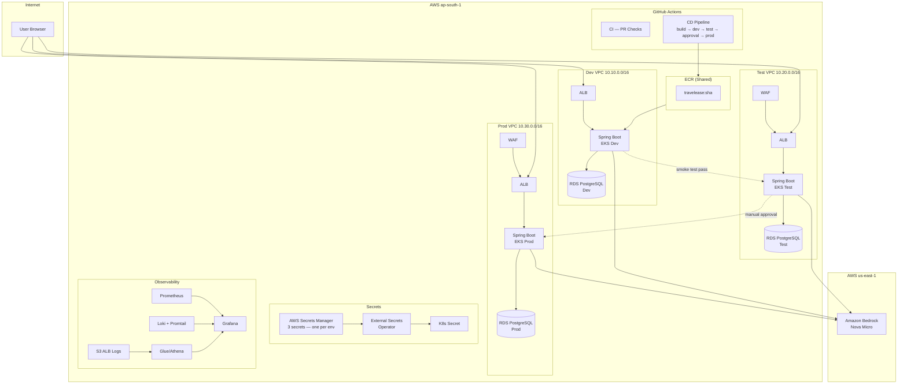

# TravelEase — AI-Powered Travel Booking Platform on AWS EKS

[](https://github.com/Lakshya6373/travelease-aws-eks-cicd/actions/workflows/ci.yml)
[](https://github.com/Lakshya6373/travelease-aws-eks-cicd/actions/workflows/cd-pipeline.yml)

---

## 📖 What is This Project?

**TravelEase** is a full-stack travel booking web application built with **Java (Spring Boot)** on the backend and deployed on **Amazon EKS (Kubernetes)**. It lets users browse travel destinations, make bookings, and receive **AI-powered recommendations** using Amazon Bedrock (Nova Micro model).

This repository is not just the application — it is the **entire production-grade cloud infrastructure** as well. Everything from the networking (VPC) to the database (RDS PostgreSQL), Kubernetes cluster, security, monitoring, and CI/CD pipelines is defined as code and automated.

### What does it actually do?

| Feature | Description |
|---|---|
| 🔐 **User Auth** | Register and login with JWT-based authentication |
| 🌍 **Destinations** | Browse travel destinations with categories (Beach, Mountain, City, etc.) |
| 📅 **Bookings** | Book a destination for a date range with number of travellers |
| 🤖 **AI Recommendations** | Ask for personalized trip suggestions powered by Amazon Bedrock (Nova Micro LLM) |
| 📊 **Observability** | Full metrics, logs, and dashboards via Prometheus + Grafana + Loki |

---

## 🗂️ What's Inside This Repository?

Here is a plain-English explanation of every folder in this repo:

```
travelease-aws-eks-cicd/
│
├── app/                        ← The Spring Boot Java application (the actual product)
│   ├── src/main/java/          ← All Java source code
│   │   └── ai/travelease/
│   │       ├── domain/         ← Database models: User, Booking, Destination, Category
│   │       ├── repository/     ← Database access (Spring Data JPA)
│   │       ├── service/        ← Business logic: BookingService, RecommendationService, etc.
│   │       ├── web/            ← REST API controllers (AuthController, BookingController, etc.)
│   │       ├── dto/            ← Request/response data transfer objects
│   │       └── config/         ← Security config, AWS Bedrock config, etc.
│   ├── Dockerfile              ← How to package the app into a Docker image
│   ├── docker-compose.yml      ← Run the app + PostgreSQL locally with one command
│   └── pom.xml                 ← Maven dependencies (Spring Boot, JWT, AWS SDK, etc.)
│
├── terraform/                  ← All AWS infrastructure defined as code (Terraform)
│   ├── bootstrap/              ← One-time setup: S3 bucket for storing Terraform state
│   ├── environments/
│   │   ├── shared/             ← Shared ECR (Docker image registry) — used by all envs
│   │   ├── dev/                ← Development environment infrastructure
│   │   ├── test/               ← Testing environment infrastructure (+ WAF enabled)
│   │   └── prod/               ← Production environment infrastructure (+ WAF + approvals)
│   └── modules/                ← Reusable Terraform building blocks
│       ├── vpc/                ← Creates an isolated network (VPC, subnets, NAT gateway)
│       ├── eks/                ← Creates the Kubernetes cluster
│       ├── rds/                ← Creates the PostgreSQL database
│       ├── waf/                ← Web Application Firewall (blocks malicious traffic)
│       ├── ecr/                ← Elastic Container Registry (stores Docker images)
│       ├── secrets-manager/    ← Stores DB passwords and JWT secrets securely
│       ├── security-groups/    ← Firewall rules between components
│       ├── irsa-alb-controller/← AWS IAM role for the Kubernetes load balancer controller
│       ├── irsa-bedrock/       ← AWS IAM role for the app to call Bedrock AI
│       ├── irsa-external-secrets/ ← AWS IAM role to fetch secrets into Kubernetes
│       └── access-logging/     ← S3 bucket + Glue/Athena for ALB access log analysis
│
├── helm/travelease/            ← Kubernetes deployment templates (Helm chart)
│   ├── templates/
│   │   ├── deployment.yaml     ← How to run the app in Kubernetes
│   │   ├── service.yaml        ← Internal networking for the app pods
│   │   ├── ingress.yaml        ← Exposes the app to the internet via ALB
│   │   ├── externalsecret.yaml ← Pulls secrets from AWS Secrets Manager into K8s
│   │   ├── hpa.yaml            ← Auto-scales pods based on CPU usage
│   │   ├── pdb.yaml            ← Ensures at least 1 pod stays running during updates
│   │   ├── configmap.yaml      ← Non-sensitive app configuration
│   │   ├── serviceaccount.yaml ← Kubernetes identity linked to AWS IAM role
│   │   └── servicemonitor.yaml ← Tells Prometheus to scrape metrics from this app
│   ├── values.yaml             ← Default config values
│   ├── values-dev.yaml         ← Dev environment overrides
│   ├── values-test.yaml        ← Test environment overrides
│   └── values-prod.yaml        ← Prod environment overrides (HA, more replicas)
│
├── .github/workflows/
│   ├── ci.yml                  ← Runs on every Pull Request: compile, test, security scan
│   └── cd-pipeline.yml         ← Runs on push to main: build image → deploy dev → test → prod
│
├── scripts/
│   ├── bootstrap-cluster.sh    ← Installs required tools onto a fresh EKS cluster
│   ├── smoke-test.sh           ← Hits the app's health endpoint to verify it's alive
│   └── destroy-all.sh          ← Tears down all infrastructure (prod → test → dev → shared)
│
├── APPROACH.md                 ← Design decisions and architectural reasoning
└── CHALLENGES.md               ← Problems faced and how they were solved
```

---

## 🏗️ System Architecture

Here is how all the pieces fit together:

```
User Browser
     │
     ▼
[AWS WAF] ──── blocks bad traffic (test/prod only)
     │
     ▼
[Application Load Balancer]
     │
     ▼
[EKS Kubernetes Cluster]
  └── Spring Boot App (pods, auto-scaled with HPA)
        │                  │
        ▼                  ▼
  [RDS PostgreSQL]   [Amazon Bedrock]
   (private subnet)   (Nova Micro AI, us-east-1)
        │
   [AWS Secrets Manager] ──► [External Secrets Operator] ──► K8s Secret
```

### 3 Completely Isolated Environments

| Environment | VPC CIDR | WAF | Purpose |
|---|---|---|---|
| **dev** | 10.10.0.0/16 | ❌ Off (saves cost) | Active development, fast deploys |
| **test** | 10.20.0.0/16 | ✅ On | Integration testing, smoke tests |
| **prod** | 10.30.0.0/16 | ✅ On | Live production — requires manual approval to deploy |

Each environment has its own VPC, EKS cluster, RDS database, and Secrets Manager entry. They share one ECR registry and one S3 state bucket.

---

## ⚙️ REST API Endpoints

Once the app is running (locally or on EKS), these are the available endpoints:

| Method | Endpoint | What it does |
|---|---|---|
| `POST` | `/api/auth/register` | Create a new user account |
| `POST` | `/api/auth/login` | Login and receive a JWT token |
| `GET` | `/api/destinations` | List all available travel destinations |
| `GET` | `/api/destinations/{id}` | Get details of a single destination |
| `POST` | `/api/bookings` | Create a new booking (auth required) |
| `GET` | `/api/bookings` | List your bookings (auth required) |
| `GET` | `/api/bookings/{id}` | Get a specific booking (auth required) |
| `DELETE` | `/api/bookings/{id}` | Cancel a booking (auth required) |
| `POST` | `/api/recommendations` | Get AI-powered trip recommendations |
| `GET` | `/actuator/health` | Health check (used by Kubernetes probes) |
| `GET` | `/actuator/prometheus` | Metrics endpoint (scraped by Prometheus) |

---

## 🛠️ Prerequisites — What You Need Installed

Install these tools before you start:

| Tool | Min Version | What it's for | Install Link |
|------|-------------|---------------|--------------|
| **AWS CLI** | v2 | Talk to AWS from your terminal | [Install](https://aws.amazon.com/cli/) |
| **Terraform** | ≥ 1.11 | Create/manage all AWS infrastructure | [Install](https://developer.hashicorp.com/terraform/downloads) |
| **kubectl** | ≥ 1.31 | Talk to Kubernetes clusters | [Install](https://kubernetes.io/docs/tasks/tools/) |
| **Helm** | ≥ 3.15 | Deploy the app to Kubernetes | [Install](https://helm.sh/docs/intro/install/) |
| **Docker** | ≥ 24 | Build and run containers locally | [Install](https://docs.docker.com/get-docker/) |
| **Java** | 17 (Temurin) | Run the Spring Boot app locally | [Install](https://adoptium.net/) |
| **Maven** | 3.9 | Build the Java application | Bundled in the build Docker image |

You also need:
- An **AWS account** with permissions to create EKS, VPC, RDS, ECR, IAM, Secrets Manager, Bedrock
- AWS CLI configured: run `aws configure` with your Access Key and Secret Key
- A **GitHub account** with this repo forked (for CI/CD)

---

## 🚀 How to Run Locally (Quickest Way — No AWS Needed)

If you just want to run the app on your laptop without any AWS infrastructure:

```bash
# 1. Go to the app folder
cd app

# 2. Build and start both the app and a local PostgreSQL database
docker-compose up --build

# 3. Open the app in your browser
# → http://localhost:8080

# 4. To stop everything
docker-compose down
```

> **Note:** The AI recommendation feature is disabled by default in local mode (`RECOMMENDATION_ENABLED=false`). You do not need any AWS credentials to run locally.

To test the AI feature locally with real AWS credentials:
1. Set up `~/.aws/credentials` with your AWS keys
2. Edit `app/docker-compose.yml` and set `RECOMMENDATION_ENABLED: "true"`
3. Restart with `docker-compose up`

---

## ☁️ Full AWS Deployment — Step by Step

### Step 1: Bootstrap (One-time setup — do this once ever)

This creates the S3 bucket where Terraform stores its state files.

```bash
cd terraform/bootstrap
cp terraform.tfvars.example terraform.tfvars
# Open terraform.tfvars and set a unique bucket_name, e.g.:
# bucket_name = "travelease-tfstate-lakshya6373"

terraform init
terraform apply -auto-approve

# Note the bucket_name output — you will need it in the next step
```

Now create the shared ECR registry (Docker image storage used by all environments):

```bash
cd ../environments/shared
terraform init
terraform apply -auto-approve

# Note the ecr_repository_url from the output — paste it into GitHub Variables
```

### Step 2: Update All Backend Config Files

In every `terraform/environments/<env>/backend.tf`, replace `<YOUR-UNIQUE-SUFFIX>` with the bucket name from Step 1.

```bash
# Do this for: environments/dev, environments/test, environments/prod, environments/shared
# Example change inside backend.tf:
# bucket = "travelease-tfstate-<YOUR-UNIQUE-SUFFIX>"
# becomes:
# bucket = "travelease-tfstate-lakshya6373"
```

### Step 3: Enable Amazon Bedrock AI (One-time, manual)

The AI recommendation feature requires manual model access approval in AWS:

1. Open AWS Console → switch to **us-east-1** region
2. Go to **Amazon Bedrock → Model access** (left menu)
3. Click **Manage model access**
4. Check **Amazon Nova Micro** → click **Request model access**
5. Approval is usually instant (on-demand access)

### Step 4: Configure GitHub Repository Settings

Go to your GitHub repo → **Settings** and configure the following:

**Environments** (`Settings → Environments → New environment`):

| Environment Name | Protection Rule |
|---|---|
| `dev` | None (deploys automatically) |
| `test` | None (deploys after smoke tests pass) |
| `production` | ✅ **Required reviewers: add yourself** |

**Repository Secrets** (`Settings → Secrets and variables → Actions → New repository secret`):

| Secret Name | Value |
|---|---|
| `SMTP_USERNAME` | Your email address (for failure notification emails) |
| `SMTP_PASSWORD` | Your email app password |

**Repository Variables** (`Settings → Secrets and variables → Actions → Variables tab`):

| Variable Name | Example Value |
|---|---|
| `AWS_REGION` | `ap-south-1` |
| `ECR_REGISTRY` | `123456789012.dkr.ecr.ap-south-1.amazonaws.com` |
| `SHARED_ECR_PUSH_ROLE_ARN` | IAM role ARN from the `shared` Terraform output |

**Per-Environment Variables** (set inside each GitHub Environment):

| Variable Name | Description |
|---|---|
| `DEV_DEPLOY_ROLE_ARN` | IAM role ARN for deploying to dev EKS cluster |
| `TEST_DEPLOY_ROLE_ARN` | IAM role ARN for deploying to test EKS cluster |
| `PROD_DEPLOY_ROLE_ARN` | IAM role ARN for deploying to prod EKS cluster |

### Step 5: Deploy the Dev Environment

```bash
cd terraform/environments/dev

cp terraform.tfvars.example terraform.tfvars
# Open terraform.tfvars — most values are pre-filled. Just review and confirm.

# Set sensitive values as environment variables (NEVER put passwords in files)
export TF_VAR_db_master_password="YourStrongPasswordHere123!"
export TF_VAR_jwt_secret="your-random-jwt-secret-at-least-32-chars"

terraform init
terraform plan     # Review what will be created (~30 resources)
terraform apply    # Type 'yes' to confirm — takes 15-20 minutes
```

### Step 6: Connect kubectl to the Dev Cluster

```bash
aws eks update-kubeconfig --name travelease-dev --region ap-south-1

# Verify connection
kubectl get nodes
# You should see worker nodes listed with status "Ready"
```

### Step 7: Bootstrap the Cluster (Install required Kubernetes tools)

```bash
./scripts/bootstrap-cluster.sh travelease-dev dev

# This installs (takes 5-10 minutes):
# - AWS Load Balancer Controller   → automatically creates ALBs for Ingress resources
# - External Secrets Operator      → syncs secrets from AWS Secrets Manager into K8s
# - kube-prometheus-stack          → Prometheus + Grafana + Alertmanager
# - Loki + Promtail                → log collection and aggregation
```

### Step 8: Deploy Test and Prod (Repeat Steps 5–7)

```bash
# Test environment
cd terraform/environments/test
export TF_VAR_db_master_password="TestEnvPassword123!"
export TF_VAR_jwt_secret="test-jwt-secret-32chars-minimum"
terraform init && terraform apply
aws eks update-kubeconfig --name travelease-test --region ap-south-1
./scripts/bootstrap-cluster.sh travelease-test test

# Prod environment
cd terraform/environments/prod
export TF_VAR_db_master_password="ProdStrongPassword456!"
export TF_VAR_jwt_secret="prod-jwt-secret-32chars-minimum"
terraform init && terraform apply
aws eks update-kubeconfig --name travelease-prod --region ap-south-1
./scripts/bootstrap-cluster.sh travelease-prod prod
```

### Step 9: Trigger Your First Deployment

```bash
# Push any change to the main branch to trigger the full CD pipeline
git push origin main

# Watch it in GitHub → Actions tab
# Order: build image → dev → smoke test → test → smoke test → ⏸ approval → prod
```

---

## 🔄 CI/CD Pipeline — How Deployments Work

### CI Pipeline (every Pull Request)

When you open or update a Pull Request, GitHub Actions automatically runs:

1. **Compile** the Java code with Maven
2. **Unit tests** with JUnit
3. **OWASP Dependency-Check** — fails if any Maven dependency has a CVSS score ≥ 7
4. **Trivy image scan** — fails if HIGH or CRITICAL CVEs are found in the Docker image

> All checks must pass before the PR can be merged.

### CD Pipeline (every push to `main`)

```
Push to main
    ↓
Build Docker image (tagged with Git commit SHA)
Push to ECR
    ↓
Deploy to Dev EKS  →  Run smoke test (hits /actuator/health)
    ↓  (on success)
Deploy to Test EKS →  Run smoke test
    ↓  (on success)
⏸ PAUSE — Wait for manual approval in GitHub UI
    ↓  (you click "Approve" in the GitHub Actions page)
Deploy to Prod EKS →  Run smoke test
    ↓
✅ Done! New version is live in production.
```

The Docker image tag is the **Git commit SHA** (e.g., `travelease:a91b911`), making every deployment fully traceable.

---

## 📊 Monitoring & Observability

Once deployed, you have a full observability stack available.

### Access Grafana (Metrics Dashboards)

```bash
kubectl port-forward -n monitoring svc/kube-prometheus-stack-grafana 3000:80
# Open: http://localhost:3000
# Username: admin
# Get password:
kubectl get secret -n monitoring kube-prometheus-stack-grafana \
  -o jsonpath="{.data.admin-password}" | base64 --decode
```

Pre-built dashboards show:
- Kubernetes cluster health (CPU, memory, pod restarts)
- Application metrics (request rate, latency, error rate)
- JVM metrics (heap memory, GC pauses, thread count)
- ALB access logs via Glue/Athena

### Access Prometheus (Raw Metrics)

```bash
kubectl port-forward -n monitoring svc/kube-prometheus-stack-prometheus 9090:9090
# Open: http://localhost:9090
```

### View Application Logs (Loki in Grafana)

In Grafana → **Explore** → Select datasource **"Loki"** → Enter query:
```
{namespace="travelease"}
```

### Get the Public Application URL

```bash
kubectl get ingress -n travelease
# The ADDRESS column shows the public ALB URL (takes ~2 min to provision on first deploy)
```

---

## 🔐 Security Controls

| Control | How It's Implemented |
|---|---|
| **No static AWS keys** | GitHub OIDC → `sts:AssumeRoleWithWebIdentity`; no credentials stored in GitHub Secrets |
| **Secrets never in code** | DB passwords and JWT secrets live in AWS Secrets Manager, injected at pod runtime |
| **Private subnets** | EKS nodes and RDS are in private subnets; only the ALB is in public subnets |
| **WAF protection** | Blocks SQL injection, XSS, bad bots, and rate-limits requests (test + prod only) |
| **Non-root containers** | App runs as user 1000; `runAsNonRoot: true` in pod security context |
| **Image scanning** | Trivy blocks CI/CD if HIGH or CRITICAL CVEs found in Docker image |
| **Dependency scanning** | OWASP Dependency-Check fails CI on any Maven dep with CVSS ≥ 7 |
| **Least-privilege IAM** | ALB controller, Bedrock caller, External Secrets each have their own minimal IAM role |
| **Shield Standard** | Automatic DDoS protection on all ALBs (no extra config needed) |
| **Security Groups** | RDS only accepts connections from EKS node SG; nodes only accept from ALB SG on port 8080 |

---

## 💰 Cost Guide

Approximate cost if you spin up all 3 environments for a full day:

| Resource | Approx. Cost |
|---|---|
| 3× EKS clusters (`t3.medium` nodes) | ~$0.30/hour each |
| 3× RDS PostgreSQL (`db.t3.micro`) | ~$0.017/hour each |
| 3× NAT Gateways | ~$0.045/hour each |
| ECR + S3 (state + logs) | Cents |
| **Full demo (build + deploy + destroy same day)** | **< $5 total** |

**Cost-saving decisions built into the design:**
- 1 NAT Gateway per VPC (not 1 per AZ → saves ~$65/month if left running)
- `t3.small/medium` node sizes with HPA scaling to minimum when idle
- WAF disabled on dev (saves ~$9/month per dev env)
- S3 native state locking — no DynamoDB table needed
- ECR lifecycle policy automatically removes old images
- Prometheus stores only 3 days of metrics (minimal EBS cost)

---

## 🗑️ Teardown — Destroy Everything

When you are done, destroy all infrastructure to stop AWS charges:

```bash
./scripts/destroy-all.sh
# Destroys in safe order: prod → test → dev → shared
# The S3 state bucket and ECR are kept by default (cost: cents/month)
# To also delete those:
cd terraform/bootstrap && terraform destroy
```

---

## 📁 Key Configuration Files Reference

| File | What to Edit |
|---|---|
| `terraform/environments/dev/terraform.tfvars` | Dev cluster size, DB instance type, region |
| `terraform/environments/prod/terraform.tfvars` | Prod replica count, node size |
| `helm/travelease/values-prod.yaml` | Pod replicas, resource requests/limits for prod |
| `helm/travelease/values.yaml` | Default app configuration for all environments |
| `.github/workflows/cd-pipeline.yml` | CI/CD pipeline steps, timings, and environment settings |
| `app/docker-compose.yml` | Local development environment config |

---

## ❓ Troubleshooting

**Pods are not starting:**
```bash
kubectl get pods -n travelease
kubectl describe pod <pod-name> -n travelease
kubectl logs <pod-name> -n travelease
```

**External Secrets not syncing (app can't get DB password):**
```bash
kubectl get externalsecret -n travelease
kubectl describe externalsecret travelease-secrets -n travelease
# Check the IRSA role has GetSecretValue permission on Secrets Manager
```

**ALB not getting a public address:**
```bash
kubectl get ingress -n travelease
kubectl logs -n kube-system -l app.kubernetes.io/name=aws-load-balancer-controller
```

**Terraform state lock error (from a crashed apply):**
```bash
terraform force-unlock <LOCK_ID>
```

**kubectl shows "Unauthorized" after switching clusters:**
```bash
aws eks update-kubeconfig --name travelease-dev --region ap-south-1
```

---

## 📚 Further Reading

- [APPROACH.md](./APPROACH.md) — Why certain architectural decisions were made
- [CHALLENGES.md](./CHALLENGES.md) — Problems encountered during the build and how they were solved
- [Amazon EKS Docs](https://docs.aws.amazon.com/eks/)
- [Amazon Bedrock Docs](https://docs.aws.amazon.com/bedrock/)
- [Terraform AWS Provider](https://registry.terraform.io/providers/hashicorp/aws/latest/docs)
- [Spring Boot Reference](https://docs.spring.io/spring-boot/docs/current/reference/html/)

---

## Architecture



---

## Prerequisites

| Tool | Version | Install |
|------|---------|---------|
| AWS CLI | v2 | [aws.amazon.com/cli](https://aws.amazon.com/cli/) |
| Terraform | ≥ 1.11 | [terraform.io](https://developer.hashicorp.com/terraform/downloads) |
| Helm | ≥ 3.15 | [helm.sh](https://helm.sh/docs/intro/install/) |
| kubectl | ≥ 1.31 | [kubernetes.io](https://kubernetes.io/docs/tasks/tools/) |
| Docker | ≥ 24 | [docker.com](https://docs.docker.com/get-docker/) |
| Java | 17 (Temurin) | [adoptium.net](https://adoptium.net/) |
| Maven | 3.9 | Included in build image |

---

## Setup & Run

### 1. Bootstrap (one-time, by hand)

```bash
# Create the Terraform state S3 bucket
cd terraform/bootstrap
cp terraform.tfvars.example terraform.tfvars   # edit bucket_name
terraform init && terraform apply -auto-approve
# Note the bucket_name output — paste it into every backend.tf (search <YOUR-UNIQUE-SUFFIX>)

# Create the shared ECR registry
cd ../environments/shared
terraform init && terraform apply -auto-approve
# Note the ecr_repository_url output
```

### 2. Enable Bedrock (manual, once per AWS account)

1. Go to AWS Console → Amazon Bedrock → Model access (`us-east-1` region)
2. Request access to **Amazon Nova Micro**
3. Wait for approval (usually instant for on-demand)

### 3. Deploy Dev Infrastructure

```bash
cd terraform/environments/dev
cp terraform.tfvars.example terraform.tfvars  # already pre-filled except passwords
terraform init && terraform plan
terraform apply

# Set sensitive vars via environment variables (never in tfvars):
export TF_VAR_db_master_password="your-strong-password-here"
export TF_VAR_jwt_secret="your-jwt-secret-here"
```

### 4. Bootstrap the Dev Cluster

```bash
aws eks update-kubeconfig --name travelease-dev --region ap-south-1
./scripts/bootstrap-cluster.sh travelease-dev dev
```

### 5. Access the App

```bash
# Get the ALB URL
kubectl get ingress -n travelease

# Port-forward Grafana
kubectl port-forward -n monitoring svc/kube-prometheus-stack-grafana 3000:80
# Open http://localhost:3000, user: admin
```

### 6. Local Development

```bash
cd app
docker-compose up --build
# Open http://localhost:8080
# RECOMMENDATION_ENABLED=false by default — no AWS creds needed for local dev
```

### 7. CI/CD Pipeline

Push to `main` → CD pipeline automatically:
- Builds + scans with Trivy
- Deploys to dev → smoke tests → deploys to test → smoke tests
- **Pauses for manual approval** (GitHub Environments "required reviewers")
- On approval → deploys to prod → smoke tests

---

## GitHub Repository Settings (one-time manual)

```
Settings → Environments:
  dev          (no protection rules)
  test         (no protection rules)
  production   (Required reviewers: add yourself)

Repo-level secrets:
  SMTP_USERNAME   — for failure email notifications
  SMTP_PASSWORD

Repo-level variables:
  AWS_REGION           = ap-south-1
  ECR_REGISTRY         = <account-id>.dkr.ecr.ap-south-1.amazonaws.com
  SHARED_ECR_PUSH_ROLE_ARN

Environment variables (per-environment):
  DEV_DEPLOY_ROLE_ARN
  TEST_DEPLOY_ROLE_ARN
  PROD_DEPLOY_ROLE_ARN
```

---

## Security Considerations

| Control | Implementation |
|---------|---------------|
| **No static AWS keys** | GitHub OIDC → `sts:AssumeRoleWithWebIdentity` for all CI jobs |
| **IRSA least-privilege** | 3 separate roles: ALB controller, ESO, Bedrock — each scoped to minimum actions/resources |
| **Secrets management** | AWS Secrets Manager → External Secrets Operator → K8s Secret; pods never see plaintext in env files |
| **Private subnets** | EKS nodes and RDS are in private subnets; only ALB is in public subnets |
| **Security group least-privilege** | RDS accepts connections from node SG only; nodes accept from ALB SG on app port only |
| **WAF** | 3 managed rule groups + rate-limiting on test and prod; disabled on dev to save cost |
| **Shield Standard** | Automatic on all ALBs (no additional config needed) |
| **Non-root containers** | `runAsNonRoot: true`, `runAsUser: 1000` in Deployment securityContext |
| **Image scanning** | ECR scan-on-push + Trivy in CI (blocks push on HIGH/CRITICAL CVEs) |
| **Dependency scanning** | OWASP Dependency-Check on every PR (fails on CVSS ≥ 7) |

---

## Cost Optimization

| Decision | Saving |
|----------|--------|
| 1 NAT gateway per VPC (not 1 per AZ) | ~$65/month if left running vs $195 |
| `t3.small/medium` nodes, HPA scale-to-min | Scales down when idle |
| S3 native locking (`use_lockfile=true`) | No DynamoDB table needed (~$1/month savings at this scale) |
| WAF disabled on dev | ~$9/month savings per dev env |
| ECR lifecycle policy | Avoids storage cost from stale images |
| 3-day Prometheus retention | Minimal EBS cost on monitoring PVC |
| **Apply → destroy same day** | Total spend < $5 for a full build+demo cycle |

```bash
# Same-day teardown
./scripts/destroy-all.sh
```

---

## Teardown

```bash
./scripts/destroy-all.sh
# Destroys: prod → test → dev → shared → bootstrap (optional)
# Leaves ECR and state bucket intact by default (cents/month)
```
