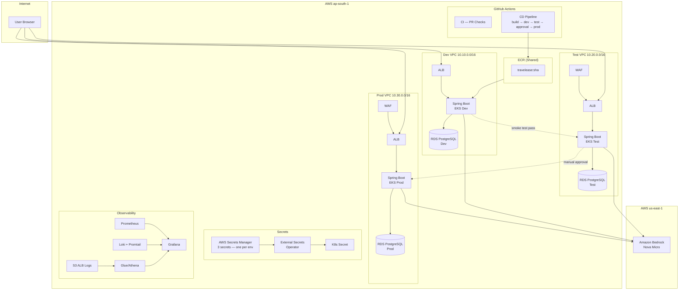

# TravelEase — AI-Powered Travel Booking on AWS EKS

[](https://github.com/Lakshya6373/travelease-aws-eks-cicd/actions/workflows/ci.yml)
[](https://github.com/Lakshya6373/travelease-aws-eks-cicd/actions/workflows/cd-pipeline.yml)

A production-grade travel booking platform built with Spring Boot, deployed across **3 isolated AWS EKS environments** (dev / test / prod) with Bedrock AI recommendations, full observability, WAF, and GitOps-style environment promotion.

---

## Architecture



---

## Prerequisites

| Tool | Version | Install |
|------|---------|---------|
| AWS CLI | v2 | [aws.amazon.com/cli](https://aws.amazon.com/cli/) |
| Terraform | ≥ 1.11 | [terraform.io](https://developer.hashicorp.com/terraform/downloads) |
| Helm | ≥ 3.15 | [helm.sh](https://helm.sh/docs/intro/install/) |
| kubectl | ≥ 1.31 | [kubernetes.io](https://kubernetes.io/docs/tasks/tools/) |
| Docker | ≥ 24 | [docker.com](https://docs.docker.com/get-docker/) |
| Java | 17 (Temurin) | [adoptium.net](https://adoptium.net/) |
| Maven | 3.9 | Included in build image |

---

## Setup & Run

### 1. Bootstrap (one-time, by hand)

```bash
# Create the Terraform state S3 bucket
cd terraform/bootstrap
cp terraform.tfvars.example terraform.tfvars   # edit bucket_name
terraform init && terraform apply -auto-approve
# Note the bucket_name output — paste it into every backend.tf (search <YOUR-UNIQUE-SUFFIX>)

# Create the shared ECR registry
cd ../environments/shared
terraform init && terraform apply -auto-approve
# Note the ecr_repository_url output
```

### 2. Enable Bedrock (manual, once per AWS account)

1. Go to AWS Console → Amazon Bedrock → Model access (`us-east-1` region)
2. Request access to **Amazon Nova Micro**
3. Wait for approval (usually instant for on-demand)

### 3. Deploy Dev Infrastructure

```bash
cd terraform/environments/dev
cp terraform.tfvars.example terraform.tfvars  # already pre-filled except passwords
terraform init && terraform plan
terraform apply

# Set sensitive vars via environment variables (never in tfvars):
export TF_VAR_db_master_password="your-strong-password-here"
export TF_VAR_jwt_secret="your-jwt-secret-here"
```

### 4. Bootstrap the Dev Cluster

```bash
aws eks update-kubeconfig --name travelease-dev --region ap-south-1
./scripts/bootstrap-cluster.sh travelease-dev dev
```

### 5. Access the App

```bash
# Get the ALB URL
kubectl get ingress -n travelease

# Port-forward Grafana
kubectl port-forward -n monitoring svc/kube-prometheus-stack-grafana 3000:80
# Open http://localhost:3000, user: admin
```

### 6. Local Development

```bash
cd app
docker-compose up --build
# Open http://localhost:8080
# RECOMMENDATION_ENABLED=false by default — no AWS creds needed for local dev
```

### 7. CI/CD Pipeline

Push to `main` → CD pipeline automatically:
- Builds + scans with Trivy
- Deploys to dev → smoke tests → deploys to test → smoke tests
- **Pauses for manual approval** (GitHub Environments "required reviewers")
- On approval → deploys to prod → smoke tests

---

## GitHub Repository Settings (one-time manual)

```
Settings → Environments:
  dev          (no protection rules)
  test         (no protection rules)
  production   (Required reviewers: add yourself)

Repo-level secrets:
  SMTP_USERNAME   — for failure email notifications
  SMTP_PASSWORD

Repo-level variables:
  AWS_REGION           = ap-south-1
  ECR_REGISTRY         = <account-id>.dkr.ecr.ap-south-1.amazonaws.com
  SHARED_ECR_PUSH_ROLE_ARN

Environment variables (per-environment):
  DEV_DEPLOY_ROLE_ARN
  TEST_DEPLOY_ROLE_ARN
  PROD_DEPLOY_ROLE_ARN
```

---

## Security Considerations

| Control | Implementation |
|---------|---------------|
| **No static AWS keys** | GitHub OIDC → `sts:AssumeRoleWithWebIdentity` for all CI jobs |
| **IRSA least-privilege** | 3 separate roles: ALB controller, ESO, Bedrock — each scoped to minimum actions/resources |
| **Secrets management** | AWS Secrets Manager → External Secrets Operator → K8s Secret; pods never see plaintext in env files |
| **Private subnets** | EKS nodes and RDS are in private subnets; only ALB is in public subnets |
| **Security group least-privilege** | RDS accepts connections from node SG only; nodes accept from ALB SG on app port only |
| **WAF** | 3 managed rule groups + rate-limiting on test and prod; disabled on dev to save cost |
| **Shield Standard** | Automatic on all ALBs (no additional config needed) |
| **Non-root containers** | `runAsNonRoot: true`, `runAsUser: 1000` in Deployment securityContext |
| **Image scanning** | ECR scan-on-push + Trivy in CI (blocks push on HIGH/CRITICAL CVEs) |
| **Dependency scanning** | OWASP Dependency-Check on every PR (fails on CVSS ≥ 7) |

---

## Cost Optimization

| Decision | Saving |
|----------|--------|
| 1 NAT gateway per VPC (not 1 per AZ) | ~$65/month if left running vs $195 |
| `t3.small/medium` nodes, HPA scale-to-min | Scales down when idle |
| S3 native locking (`use_lockfile=true`) | No DynamoDB table needed (~$1/month savings at this scale) |
| WAF disabled on dev | ~$9/month savings per dev env |
| ECR lifecycle policy | Avoids storage cost from stale images |
| 3-day Prometheus retention | Minimal EBS cost on monitoring PVC |
| **Apply → destroy same day** | Total spend < $5 for a full build+demo cycle |

```bash
# Same-day teardown
./scripts/destroy-all.sh
```

---

## Teardown

```bash
./scripts/destroy-all.sh
# Destroys: prod → test → dev → shared → bootstrap (optional)
# Leaves ECR and state bucket intact by default (cents/month)
```
